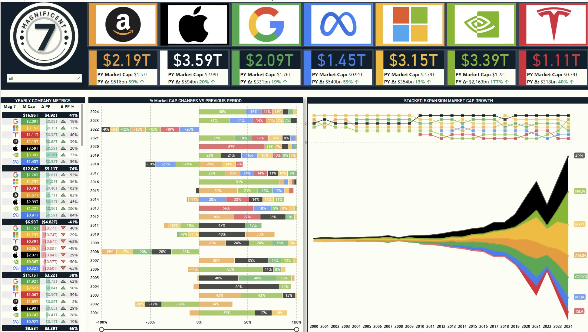

The Magnificent 7 – Power BI Interactive Market Cap Dashboard  
Built with Power BI, DAX, and advanced data modeling

## 🖼️ Dashboard Preview

> To explore the dashboard interactively, download the `.pbix` file and open it with [Power BI Desktop](https://powerbi.microsoft.com/desktop/).

🧠 Project Overview

Passionate of the Stock Market, I wanted to create this dashboard which explores the market capitalization evolution of the so-called “Magnificent 7", the seven most dominant tech companies in the world: Apple, Microsoft, Amazon, Google, Meta, Nvidia, and Tesla.

These companies are recognized not only for their massive market valuations, but also for their disproportionate influence on global stock indices, tech innovation, and investor sentiment. Over the past two decades, they have shaped the digital economy and consistently outperformed the broader market.

The goal of this project is to provide a clear, visual, and interactive understanding of how their valuations have shifted over time, how they compare against one another, and how each has contributed to the overall tech sector’s growth.

This dashboard was entirely built using Power BI with a strong focus on:
- Custom visual storytelling
- Advanced DAX calculations
- Clean data modeling
- Executive-level design and layout

🎯 Project Objectives

- Visualize long-term growth and performance of the top 7 tech companies.
- Highlight year-over-year market cap changes and relative ranking.
- Deliver a dynamic, executive-style dashboard using Power BI best practices.
- Demonstrate expertise in DAX, data modeling, and dashboard UI/UX.

📁 Data & Model

Datasets Used
- `Companies.csv`: Company metadata (name, logo, colors, IPO year)
- `Mag 7 Historical Market Cap.csv`: Historical market cap by company and year

While the datasets are intentionally lightweight, they were significantly enriched through calculated measures and dynamic modeling in Power BI.

Modeling Approach
- Star schema: clean separation between dimension tables (Companies, Dates) and fact table (Market Cap)
- Robust relationships for filtering and slicer interaction
- Use of image fields for brand logos directly within visuals

DAX Calculations & Techniques

The model includes a variety of advanced DAX calculations, such as:

- `Total Market Cap`  
- `Previous Year Market Cap`  
- `YoY Δ Absolute & %`  
- `Market Cap Rank by Year`  
- `Label Positioning` logic for optimized layout  
- `Custom plug values` to fill data gaps in area charts  
- `Chart Value` logic to simulate stacked data visualizations

These calculations support layered visuals and enhance interactivity.

📊 Key Visuals

| Visual Component | Description 

| Top Banner Cards | Live market cap display with YoY growth & delta values |
| Ranking Table | Yearly market cap, % change and company rank with icons |
| Horizontal % Change Chart | Highlights shifts in market share per company, per year |
| Stacked Area Chart | Visualizes cumulative growth and company contribution from 2000–2024 |
| Custom Company Bar | Interactive logos acting as filters and guides |

The layout is designed with modern business dashboard aesthetics, balancing clarity and data density.

 About me : 

I’m Florian Boulay, an MBA graduate from Los Angeles with a background in Information Technology (HEC Montréal) and a recent specialization in data analysis. My training includes SQL, Python, Pandas, Power BI, and cloud computing basics. I have a highly international profile and am currently seeking a junior role in IT, business analysis, or consulting in Switzerland.

This project is part of my portfolio to demonstrate my technical skills, business understanding, and attention to design and detail.

📬 Contact

- 💼 [LinkedIn]https://www.linkedin.com/in/florian-boulay-524298179/
- 📧 florian.boulay@hec.ca

